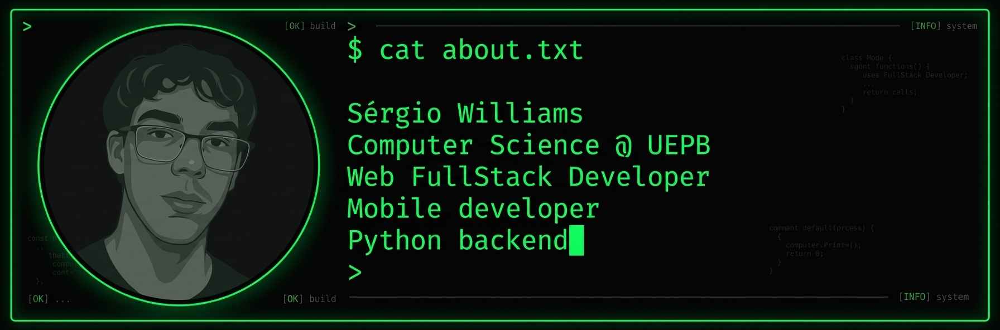
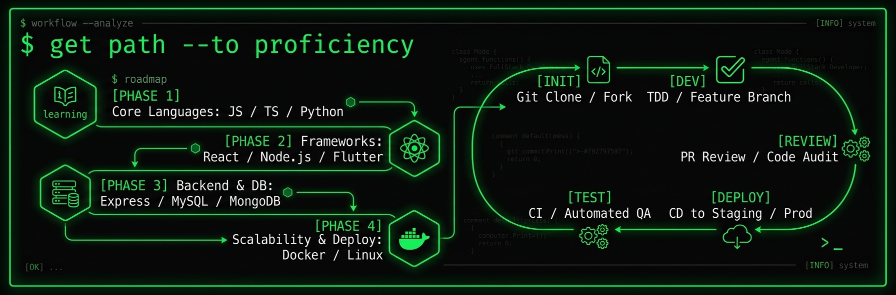

<!-- Header / Typing SVG -->

  

<!-- About / Bio Image -->

  

<!-- Tech Stack -->

 

---

 

<!-- Featured Projects -->

  <h3>Featured Projects</h3>
  

 

---

 

<!-- Snake Contribution Grid (Destaque Principal) -->

  

 

---

 

<!-- Key Metrics & Streak -->

  <h3> GitHub Overview</h3>
  
  
    
  
  

 

---

 

<!-- Roadmap & Workflow Side by Side -->

  
